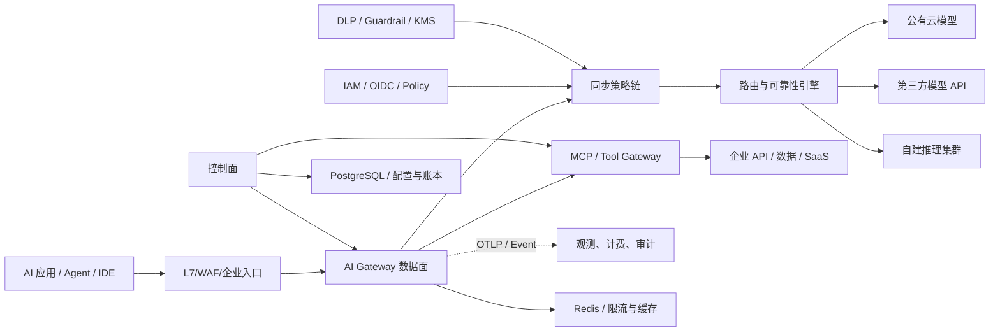

# 企业级 AI Gateway 深度调研与 0→1 实施指南

> 调研日期：2026-07-15。本文优先引用官方文档、项目仓库、标准组织与厂商工程博客；产品能力会快速变化，正式选型时应以目标版本做 PoC。

## 1. 先给结论

AI Gateway 不应只被定义成“统一调用多个模型的反向代理”。在企业内部，它是所有模型、AI 应用、Agent 和 MCP 工具之间的**运行时策略执行点**，同时也是 AI 使用的控制面。它最少要解决五类问题：

1. **统一接入**：屏蔽 OpenAI、Anthropic、Bedrock、Vertex、自建 vLLM 等协议、认证、错误码和流式格式差异。
2. **资源治理**：按租户、部门、项目、应用、用户、模型实施 RPM/TPM、并发、日/月预算和优先级控制。
3. **可靠性与成本**：负载均衡、重试、退避、熔断、fallback、模型别名、灰度、语义/精确缓存和成本路由。
4. **安全合规**：身份、模型级授权、密钥托管、DLP/PII、提示注入检测、内容审核、地域和供应商策略、审计。
5. **可观测与运营**：请求、Token、成本、TTFT、端到端延迟、错误、缓存命中、路由决策、策略命中和质量反馈。

推荐的建设思路是：**不要从零重写模型适配器和高性能代理；用成熟数据面承载流量，自研企业控制面和策略体系。** 对大多数已有 Kubernetes/Envoy 技术栈的企业，优先 PoC `Envoy AI Gateway + 企业控制面` 或 `Higress/APISIX + 自定义插件`；想最快上线统一模型与预算管理，可先用 LiteLLM 验证需求，再决定是否把长期数据面迁往 Envoy 系。

## 2. 边界：AI Gateway 管什么，不管什么

### 应该放在网关里的能力

- 与单次请求强相关、需要统一强制执行的能力：身份、授权、配额、路由、超时、审计、基础内容安全。
- 横跨所有业务且不能依赖应用自觉执行的策略：供应商白名单、数据地域、模型准入、密钥隔离、成本归集。
- 与 Provider 差异强相关的适配：协议转换、错误归一化、usage 提取、流式事件转换。

### 不宜全部塞进网关的能力

- 业务 Prompt 编排、会话记忆、RAG 检索、Agent 状态机、领域评测。
- 需要读取大量业务上下文才能判断的授权与内容决策；网关应调用外部 Policy/Guardrail Service。
- 长耗时或非阻断任务，如全量日志分析、离线评测、成本对账；应通过事件流异步处理。

经验法则：**网关执行平台政策，应用负责业务语义。** 同步链路只放必须阻断的检查，日志、分析和深度评测走旁路，否则 TTFT 会被多个串行 Guardrail 调用拖垮。

## 3. 企业能力模型

| 能力域 | L1：可用 | L2：可运营 | L3：企业级 |
|---|---|---|---|
| 接入 | OpenAI-compatible Chat | Responses/Embedding/Image/Audio、SSE | 多协议无损适配、版本契约、SDK/门户 |
| 身份 | 静态 API Key | OIDC/JWT、虚拟 Key | SSO、Workload Identity、RBAC/ABAC、密钥轮换 |
| 配额 | RPM | TPM、并发、日/月预算 | 分层配额、预留/借用、优先级、公平调度 |
| 路由 | 静态模型映射 | 权重、优先级、fallback | 成本/延迟/能力/地域/质量感知、会话黏性 |
| 可靠性 | 超时、重试 | 熔断、健康检查、幂等 | 多云多区域、故障演练、SLO/错误预算 |
| 安全 | TLS、基础审核 | PII/DLP、Prompt Injection、模型 ACL | 数据分级、地域/供应商限制、BYOK、完整审计 |
| 可观测 | 请求/错误/延迟 | Token、成本、TTFT、trace | 质量反馈、业务价值、审计取证、Showback/Chargeback |
| 开发者体验 | 单一 Endpoint | 自助申请 Key/模型 | 模型目录、策略即代码、沙箱、灰度和生命周期 |
| Agent/MCP | 透传 | MCP Server 聚合 | Tool 级授权、OAuth 代办、参数审计、人工审批 |

## 4. 推荐总体架构



### 数据面

- 无状态、多副本，负责热路径；本地只保留短生命周期缓存。
- SSE/Chunked Streaming 必须端到端透传，避免缓冲整个响应。
- 配置由控制面下发并带版本；使用 last-known-good，控制面故障时数据面继续服务。
- 阻断策略 fail-open 还是 fail-closed 必须逐策略定义，不能全局一刀切。

### 控制面

- 管理租户、应用、身份映射、模型目录、Provider 凭据引用、路由策略、配额、价格表、Guardrail 策略和审计。
- 配置变更使用审批、版本、diff、回滚和灰度，配置发布与应用发版解耦。
- 不向数据面下发明文 Provider Key，优先下发 Secret 引用或使用 Workload Identity。

### 分析面

- 请求完成后产生不可变 usage event，经 Kafka/Pulsar 等进入成本账本、数据仓库和监控系统。
- Prompt/Response 原文默认不入普通日志；按数据级别选择不记录、哈希、脱敏、加密存储或短期抽样。
- 计费账本和业务日志分离，保证重放、去重和对账。

Envoy AI Gateway 的官方架构也是控制面/数据面分离：Kubernetes API 与 Controller 管配置，Envoy Proxy + External Processor 处理 AI 转换，独立 Rate Limit Service 处理 Token 限制。见 [System Architecture Overview](https://aigateway.envoyproxy.io/docs/next/concepts/architecture/system-architecture/)。

## 5. 一次请求的正确处理顺序

1. **接入与身份**：校验 mTLS/OIDC/JWT/API Key；生成 `request_id`、`trace_id`，解析 tenant/project/app/user。
2. **粗粒度防护**：请求体大小、连接数、RPM、并发、Schema 校验，尽早拒绝明显异常。
3. **规范化**：把调用转为内部 Canonical Request；保留供应商专有扩展，禁止静默丢字段。
4. **预估成本**：按候选模型 tokenizer 估算输入 Token，并为输出预留 `max_tokens` 或策略值。
5. **授权与策略**：模型 ACL、数据分级、地域、供应商、功能（tool/image/file）和时间段策略。
6. **输入 Guardrail**：DLP/PII、恶意 URL、Prompt Injection、内容安全；可 redact、deny、audit 或 require-approval。
7. **准入与预算预留**：原子预留 TPM/预算/并发。不能等响应后才扣费，否则并发请求会集体穿透限额。
8. **路由**：过滤不合格目标，再按优先级、成本、实时延迟、健康度和配额余量打分；记录决策原因。
9. **Provider 调用**：使用幂等键、deadline、有限重试和熔断；流式首字节立刻转发。
10. **输出策略**：对非流式可完整审核；对流式采用小窗口扫描或供应商原生审核，明确安全与 TTFT 的取舍。
11. **结算**：用 Provider 返回 usage 优先结算，估算值作兜底；释放未使用预留，写入不可变 usage event。
12. **异步分析**：成本、审计、质量反馈、离线评测、异常检测。

## 6. 最难的几个工程问题

### 6.1 Token 限流与预算不是普通 QPS 限流

建议同时存在四个约束：`RPM`、`input/output TPM`、`max concurrent`、`money budget`。计数维度至少支持 tenant → department → project → app → user/key 的层次结构。

可采用“预留—结算”模型：

```text
estimated_input  = tokenizer(request)
reserved_output  = min(request.max_tokens, policy.max_output_reserve)
reserved_cost    = price(model, estimated_input, reserved_output)

atomic_reserve(scope hierarchy, tokens, cost, concurrency)
invoke_provider()
actual = provider_usage || local_estimate
atomic_settle(reservation_id, actual)
```

关键点：

- Redis Lua/事务一次性检查并预留所有父级额度，避免“部门有额度但公司总额度已超”的竞态。
- SSE 断连后 Provider 未必停止生成；必须向上游传播取消，同时处理最终 usage 缺失。
- 不同模型 tokenizer 不同，预估只用于准入，最终账单以 Provider usage/账单对账为准。
- 微软文档明确指出：实际总 Token 在返回前不可知，并发请求可能导致超额；流式请求通常只能预估输入 Token。见 [Azure `llm-token-limit`](https://learn.microsoft.com/en-us/azure/api-management/llm-token-limit-policy)。

### 6.2 路由不能只做 round-robin

正确路由是“硬约束过滤 + 软目标打分”：

```text
candidates = models
  | capability_filter(modality, tools, context_length, json_schema)
  | policy_filter(region, vendor, data_classification, model_acl)
  | health_filter(circuit, quota, deployment_status)

score = w1*normalized_cost + w2*p95_ttft + w3*p95_latency
      + w4*error_rate + w5*quality_penalty + w6*quota_pressure
```

- `429`：优先切同模型的另一部署/Key；必要时再切等价模型。
- `5xx/timeout-before-first-token`：可安全重试或 fallback。
- **首个 Token 已发给客户端后一般不能换模型**，否则会拼接两个语义不一致的输出。
- tool calling、JSON Schema、vision、reasoning 参数的兼容性属于能力约束，不可只按模型名字路由。
- 会话类业务需要黏性；模型切换会导致风格、缓存和工具调用行为变化。

### 6.3 Provider 协议归一化

内部协议不要机械复制某一家当前 API。建议定义版本化的 Canonical Schema，并保留 `provider_extensions`：

- request：messages/input、system、tools、tool_choice、response_format、stream、sampling、reasoning、modalities、metadata。
- response event：message_start、content_delta、reasoning_delta、tool_call_delta、usage、finish、error。
- error：统一为 auth、quota、rate_limit、invalid_request、content_blocked、timeout、provider_unavailable，并保留原始状态和 request id。

不要承诺“所有模型能力完全可互换”。统一 API 应是稳定的公共子集，差异通过 capability discovery 与显式扩展暴露。LiteLLM 官方文档展示了其对 100+ 模型进行 OpenAI 格式转换、统一异常、流式格式和重试/fallback 的做法，可作为适配层参考：[LiteLLM Docs](https://docs.litellm.ai/)。

### 6.4 流式响应

- 代理、Ingress、Service Mesh、WAF 都要关闭不必要的 response buffering/compression 聚合。
- 记录 `TTFT`、`inter-token latency`、总耗时、客户端断连率，不能只看总 P95。
- 输出 Guardrail 有三种模式：先审后发（安全但失去流式）、分块延迟审查（折中）、旁路审计（最低延迟但不能阻断）。按风险等级选择。
- usage 可能只在最后一个 chunk 出现；网关必须能从增量重建响应和 tool calls，并处理尾块丢失。

### 6.5 语义缓存

语义缓存不是默认安全的降本开关。Cache key/检索分区至少包含：tenant、应用、模型族、system prompt 版本、工具集合、数据权限域、Guardrail 版本、温度/结构化输出参数。对包含 PII、动态数据、工具调用、RAG 权限上下文和高温采样的请求默认禁用。

必须保存完整 provenance：原始 request hash、模型与版本、创建时间、策略版本、相似度、TTL；命中时仍需执行输出策略。Azure APIM 的官方实现依赖 Embedding API 与支持向量检索的外部 Redis，见 [AI gateway capabilities](https://learn.microsoft.com/en-us/azure/api-management/genai-gateway-capabilities)。

### 6.6 安全边界

Prompt Injection 检测不能被当成确定性安全边界。对于 Agent，真正的安全控制是：

- 模型输出永远视为不可信数据；工具参数做 Schema、范围和业务授权校验。
- Tool 使用用户委托身份，最小权限、短期 Token；高风险写操作要求 human-in-the-loop。
- MCP Gateway 做 Server 身份、Tool allowlist、参数/返回值 DLP、调用审计、出网限制和凭据代管。
- RAG 文档与网页也属于不可信输入，要记录来源和权限上下文。

威胁建模可直接映射 [OWASP Top 10 for LLM Applications 2025](https://owasp.org/www-project-top-10-for-large-language-model-applications/assets/PDF/OWASP-Top-10-for-LLMs-v2025.pdf)，治理体系可参考 [NIST AI RMF](https://www.nist.gov/itl/ai-risk-management-framework) 与 [NIST GenAI Profile](https://nvlpubs.nist.gov/nistpubs/ai/NIST.AI.600-1.pdf)。

## 7. 建议的数据模型

核心实体建议如下：

```text
Tenant / Department / Project / Application / Principal
Provider / ProviderCredentialRef / Model / ModelDeployment / Capability
Route / RouteCandidate / RoutingPolicy / FallbackPolicy
QuotaPolicy / Budget / Reservation / UsageEvent / PriceVersion
GuardrailPolicy / PolicyBinding / PolicyDecision
VirtualKey / Role / Permission / Approval
PromptTemplateVersion / CacheEntryMetadata
AuditEvent / ConfigVersion / Rollout
```

`UsageEvent` 应不可变且具备去重键：

```json
{
  "event_id": "...",
  "request_id": "...",
  "tenant_id": "...",
  "project_id": "...",
  "principal_id_hash": "...",
  "logical_model": "coding-large",
  "provider": "...",
  "deployment": "...",
  "input_tokens": 0,
  "output_tokens": 0,
  "cached_tokens": 0,
  "estimated": false,
  "price_version": "2026-07-01",
  "cost": "0.000000",
  "currency": "USD",
  "route_reason": "primary|fallback|policy|canary",
  "policy_version": "...",
  "started_at": "...",
  "finished_at": "..."
}
```

金额使用 Decimal/定点数，价格表带生效时间；Provider 账单与内部 usage 每日对账。不要只从日志临时聚合财务数据。

## 8. 可观测性与 SLO

OpenTelemetry 的 GenAI 语义约定覆盖 Trace、Metric、Event，可作为统一字段基线，见 [OpenTelemetry GenAI 介绍](https://opentelemetry.io/blog/2024/otel-generative-ai/) 与 [GenAI Metrics Spec](https://github.com/open-telemetry/semantic-conventions/blob/main/docs/gen-ai/gen-ai-metrics.md)。

### 必备指标

- 流量：requests、active streams、RPM、input/output TPM，按 tenant/app/logical model/provider 观察。
- 延迟：gateway overhead、queue time、TTFT、total latency、tokens/sec。
- 可靠性：错误分类、retry/fallback/circuit 次数、Provider 429、客户端断连、尾块 usage 缺失。
- 成本：实际/估算 Token、成本、预算利用率、缓存节省、单位业务交易成本。
- 安全：DLP/PII/注入/内容策略命中、拒绝、redact、人工审批、异常模型访问。
- 质量：用户反馈、结构化输出合规率、工具成功率、离线 eval 分数；网关只归集，不应包办评测。

### 推荐 SLO

- Gateway 可用性与 Provider 可用性分开计算。
- 非 Guardrail 热路径的网关增加延迟：P95 < 20–30 ms（同区域、缓存外）。
- 配置发布成功率、配置收敛时间、审计事件丢失率也要有 SLO。
- 为不同优先级业务定义不同 SLO；批任务不能与在线 Agent 抢同一并发池。

## 9. 主流方案比较

| 方案 | 更适合 | 强项 | 主要注意点 |
|---|---|---|---|
| **Envoy AI Gateway** | Kubernetes/Envoy 标准化平台、自建控制面 | 控制/数据面清晰、Gateway API、外部处理器、两级网关、自建推理整合 | 项目迭代快；需要团队具备 Envoy/K8s 能力，并自行补齐门户、账单和企业流程 |
| **Higress** | 国内模型生态、希望开箱即用控制台与 Wasm 扩展 | 基于 Envoy/Istio，统一多模型、Token 限流、Fallback、语义缓存、内容安全、MCP | 深度能力应逐项验证开源版/商业版边界、插件性能与多集群控制面 |
| **Apache APISIX** | 已有 APISIX/OpenResty 体系 | 动态插件、ai-proxy、Token 限流、日志、Lua/多语言/Wasm 扩展 | AI 控制面和开发者体验需要自己建设；复杂 body/stream 处理要压测 |
| **LiteLLM Proxy** | 快速 MVP、模型适配和成本治理 | Provider 覆盖广、OpenAI 兼容、虚拟 Key、预算、路由、生态集成 | Python 热路径与数据库依赖需容量测试；升级频繁，必须固定版本、签名验证与供应链治理 |
| **Kong AI Gateway** | 已在使用 Kong/Konnect 的企业 | 成熟 API 管理、AI 插件、Guardrail、语义路由/缓存、分析 | 部分高级能力/插件属于商业产品；总成本与插件链延迟需 PoC |
| **Azure APIM AI Gateway** | Azure/Foundry 主导、强企业 IAM | Managed Identity、Token quota、语义缓存、内容安全、负载均衡/熔断、多区域 | 多区域计数是网关本地状态，需确认全局额度语义；平台绑定与成本 |
| **Portkey** | 希望较快获得托管/自托管 AI 运营能力 | Config 驱动路由、Guardrail、缓存、预算、可观测、BYO Guardrail | 企业功能和自托管边界、数据路径与合规、退出迁移方案要合同化 |
| **Cloudflare AI Gateway** | 公网/边缘入口、低运维 | 边缘可观测、缓存、请求级限流 | 官方 rate limit 主要是请求数窗口；企业层级 Token 账本、内网和复杂策略需补齐 |

官方资料入口：

- [Envoy AI Gateway GitHub](https://github.com/envoyproxy/ai-gateway)；官方仓库描述两级网关：Tier 1 做集中认证、顶层路由和全局限流，Tier 2 管自建推理入口。
- [Higress AI Gateway](https://higress.io/en/ai-gateway) 与 [Token Management](https://higress.ai/en/docs/ai/scene-guide/token-management/)。
- [APISIX ai-proxy](https://apisix.apache.org/docs/apisix/plugins/ai-proxy/) 与 [ai-rate-limiting](https://apisix.apache.org/docs/apisix/3.14/plugins/ai-rate-limiting/)。
- [Kong AI Gateway](https://developer.konghq.com/index/ai-gateway/) 与 [官方 Cookbooks](https://developer.konghq.com/cookbooks/)。
- [Portkey AI Gateway](https://portkey.ai/docs/product/ai-gateway)、[Configs](https://portkey.ai/docs/product/ai-gateway/configs)、[Guardrails](https://portkey.ai/docs/product/guardrails)。
- [Azure APIM AI Gateway](https://learn.microsoft.com/en-us/azure/api-management/genai-gateway-capabilities)。
- [Cloudflare Rate Limiting](https://developers.cloudflare.com/ai-gateway/features/rate-limiting/)。

## 10. 推荐的 0→1 技术路线

### 阶段 0：两周定义治理契约

- 选 3 个真实用例：内部 Copilot、面向客户的在线应用、批量离线任务。
- 明确数据分类、可用 Provider/Region/Model、Prompt 是否可记录、保存时长、审批者。
- 定义逻辑模型名，如 `general-fast`、`general-quality`、`coding-large`，应用不直接绑定供应商部署名。
- 定义成功指标：接入时间、可用性、TTFT 开销、成本归集准确率、安全策略覆盖率。

### 阶段 1：2–4 周 MVP

- 一个 OpenAI-compatible `/v1/chat/completions` 或 `/v1/responses` 入口。
- 2 个 Provider + 1 个自建模型；静态逻辑模型映射。
- OIDC/JWT + 虚拟 Key、模型 ACL、RPM/TPM/并发。
- Provider Key 放 KMS/Vault；基础结构化审计与 Token/成本事件。
- SSE 全链路、超时、有限重试、基础 fallback。
- Grafana/OTel 看板：请求、TTFT、P95、429/5xx、Token、成本。

MVP 可用 LiteLLM 快速验证，也可直接用 Envoy AI Gateway/Higress。**不要在 MVP 就做语义路由、全量 Prompt 记录和自研 Guardrail 模型。**

### 阶段 2：4–8 周生产化

- 控制面：租户/项目/应用、模型目录、价格版本、策略发布/回滚、自助 Key。
- 提前交付管理后台：先覆盖身份、虚拟 Key、审批和审计，再逐步加入模型/配额/价格配置；UI 不得成为授权边界。
- Redis 原子预留—结算；PostgreSQL 配置/账本；Kafka usage events。
- 权重、优先级、健康度路由；熔断、重试预算、灰度、会话黏性。
- DLP/PII、输入内容安全；高风险策略 fail-closed，低风险旁路。
- 多 AZ、负载测试、Provider 故障演练、配置控制面断网演练。

### 阶段 3：8–12+ 周平台化

- 多 Region、多云、按数据地域路由；全局/区域额度层次化。
- Showback/Chargeback、预算预警、供应商账单对账。
- 精确缓存先行，语义缓存只对白名单场景开放。
- Prompt/模型/策略版本与离线评测联动，模型升级自动跑回归和 Canary。
- MCP/Agent Gateway：Tool ACL、OAuth delegation、参数策略、人工审批、完整审计。
- 开发者门户、SDK、CLI、Terraform/GitOps、模型和工具生命周期管理。

当前项目优先级调整：先把管理后台、企业登录和审批运营闭环产品化；Anthropic 原生协议暂缓，仍可通过 OpenAI-compatible Adapter 接入兼容服务。

## 11. 如果要自己实现：建议组件与接口

### 参考技术栈

- 数据面：Envoy Proxy / Envoy AI Gateway；若团队熟悉 Go，可用 Go External Processing/独立 Policy Service。
- 控制面：Go/Java + PostgreSQL；策略用 Cedar/OPA/Rego 或自定义 CEL，但要提供决策解释。
- 限流/配额：Redis Cluster + Lua；严格全局额度可用集中 ledger，但需接受额外延迟。
- 事件：Kafka/Pulsar；分析仓库 ClickHouse/BigQuery/Snowflake。
- 观测：OpenTelemetry Collector + Prometheus/Grafana/Tempo/Loki 或企业现有平台。
- 密钥：Vault/云 KMS/Secret Manager + Workload Identity。

### 最小内部接口

```text
POST /v1/responses                    # 对应用的数据面
GET  /v1/models                       # 只返回调用者获准的逻辑模型
POST /internal/policy/evaluate        # 授权/数据/模型策略
POST /internal/quota/reserve
POST /internal/quota/settle
POST /internal/guardrails/evaluate
GET  /internal/routes/{logical_model}
POST /control/models|routes|policies  # 控制面
GET  /control/usage|cost|audit
```

所有内部调用携带 `request_id`、subject、tenant、data_classification、policy_version；日志不得包含 Provider Secret。

## 12. PoC 验收清单

### 功能

- 同一客户端无改代码切换至少两个 Provider；tool call、stream、错误码不丢语义。
- 租户/项目/用户三级额度；高并发下超额有界且能解释。
- Provider 429、5xx、慢响应、流中断时行为符合策略。
- 逻辑模型灰度和回滚不需要业务发版。

### 性能

- 0/1/3 个策略插件下分别压测非流式和 SSE；报告 P50/P95/P99 gateway overhead、TTFT、CPU/内存。
- 10k+ 长连接、客户端断连、慢客户端背压、超大 Prompt。
- Redis、Postgres、控制面、Guardrail Service 故障注入。

### 安全与合规

- Key 泄露、跨租户访问、模型越权、Prompt/日志泄密、SSR​F、工具参数注入测试。
- Prompt/Response 各字段的数据保留、脱敏、加密和删除路径可验证。
- 配置变更、策略决策、模型调用、MCP Tool 调用均能审计并关联 trace。

### 供应链

- 镜像 pin digest、SBOM、签名验证、漏洞扫描、升级窗口和回滚。
- 2026 年 LiteLLM 社区曾报告恶意 `litellm_init.pth` 的供应链事件，见 [官方仓库 Issue #24512](https://github.com/BerriAI/litellm/issues/24512)。这不等于否定该项目，但说明 AI Gateway 位于企业凭据和数据的高价值路径，不能使用 `latest`，必须做签名、固定版本和隔离权限。

## 13. 值得精读的 0→1 / 架构文章

1. [AWS：Building an AI gateway to Amazon Bedrock with Amazon API Gateway](https://aws.amazon.com/blogs/architecture/building-an-ai-gateway-to-amazon-bedrock-with-amazon-api-gateway/)：有完整参考代码，覆盖 JWT、配额、租户隔离、SigV4 转发和流式响应；适合单云第一版。
2. [AWS：Create a Generative AI Gateway](https://aws.amazon.com/blogs/machine-learning/create-a-generative-ai-gateway-to-allow-secure-and-compliant-consumption-of-foundation-models/)：较早但边界定义清晰，解释为什么传统 API Gateway 不足以处理模型 IP/EULA、审核和幻觉等问题。
3. [AWS：Enterprise-Scale GenAI Gateway](https://aws.amazon.com/blogs/industries/how-to-build-an-enterprise-scale-genai-gateway/)：把 Base Layer、Apps Layer、Control Plane、规模化与民主化服务分开，适合做企业平台蓝图。
4. [AWS：Multi-Provider Generative AI Gateway](https://aws.amazon.com/blogs/machine-learning/streamline-ai-operations-with-the-multi-provider-generative-ai-gateway-reference-architecture/)：基于 LiteLLM 的多 Provider 参考架构，覆盖私网、WAF、Guardrail、缓存、路由和治理。
5. [Envoy AI Gateway Architecture](https://aigateway.envoyproxy.io/docs/concepts/architecture/)：理解云原生控制面/数据面、External Processor 和 Gateway API 的首选材料。
6. [Kong AI Gateway Cookbooks](https://developer.konghq.com/cookbooks/)：大量可执行的路由、Guardrail、语义缓存、成本和 MCP 配方，适合从需求反推策略链。
7. [Azure APIM AI Gateway capabilities](https://learn.microsoft.com/en-us/azure/api-management/genai-gateway-capabilities)：Token 限额、语义缓存、Managed Identity、内容安全、负载均衡和熔断的系统说明。
8. [Google：Model Armor + Apigee](https://docs.cloud.google.com/model-armor/model-armor-apigee-integration)：输入/输出 sanitize 与 Token quota 如何放进 API Proxy。
9. [OpenTelemetry for Generative AI](https://opentelemetry.io/blog/2024/otel-generative-ai/)：建立供应商无关的 Trace/Metric/Event 字段体系。
10. [Higress Token Management](https://higress.ai/en/docs/ai/scene-guide/token-management/)：消费方认证、Token 限流/配额和可观测组合的实操入口。

## 14. 最终选型建议

### 场景 A：已有 Kubernetes + Envoy/Istio 平台团队

优先：**Envoy AI Gateway 或 Higress 数据面 + 自研控制面**。它最利于把企业 IAM、策略、计费、GitOps 和自建推理接进来，也避免把核心治理锁在某一模型聚合 SaaS。

### 场景 B：目标是一个月内让几十个团队统一接入模型

优先：**LiteLLM Proxy 做需求验证**，前面仍放企业 Ingress/WAF，凭据、配置、数据库和日志按生产标准部署。并行设计可替换的 Canonical API 与 Usage Event，避免应用绑定 LiteLLM 私有字段。

### 场景 C：企业已有 Kong/APISIX/Azure APIM

优先扩展现有网关，复用 IAM、门户、审计和运维体系。AI Gateway 的价值往往来自治理流程而非代理本身；新建第二套网关可能造成身份、配额和可观测双轨。

### 场景 D：强数据主权或大量自建模型

采用**两级网关**：企业 Tier 1 负责身份、全局政策和多云路由；推理集群 Tier 2 负责 GPU 感知调度、排队、batching、KV-cache affinity 和模型实例健康。不要让企业入口承担 GPU scheduler 的职责。

无论选哪种方案，都建议保留三项自主权：**逻辑模型命名与契约、不可变 usage/cost 账本、企业策略模型**。这三项决定未来能否替换数据面和供应商。
