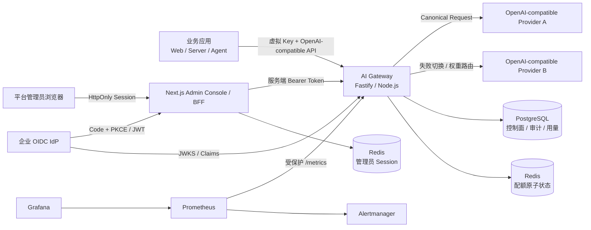
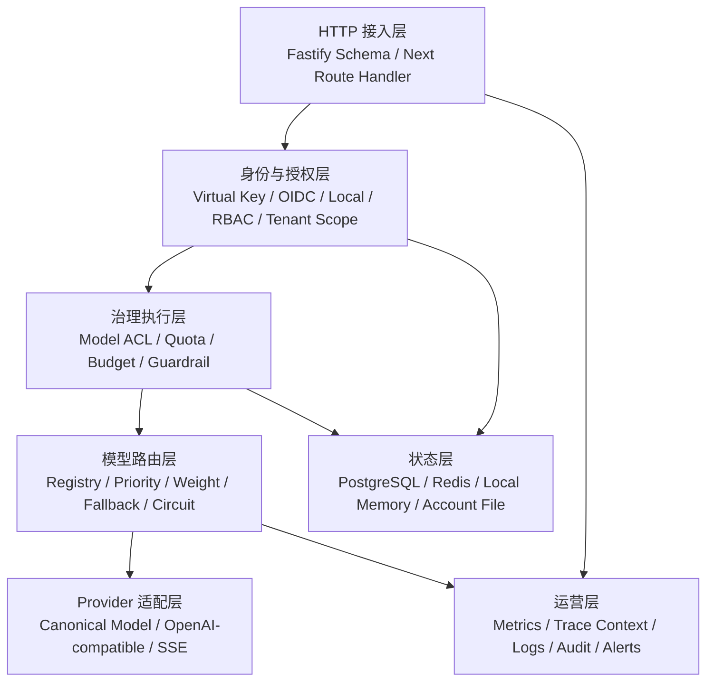
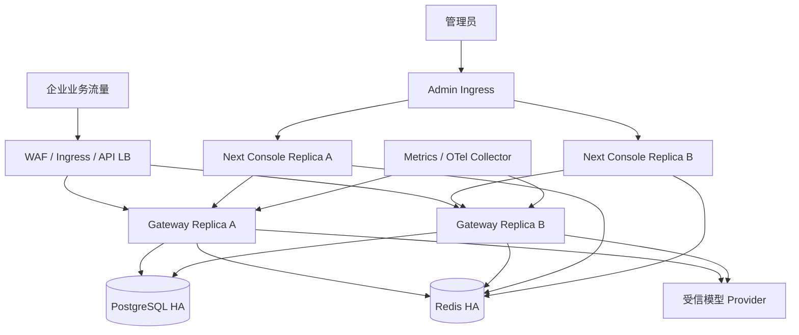
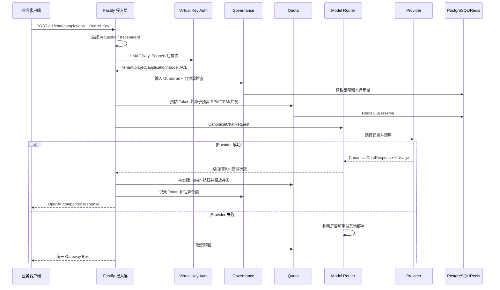
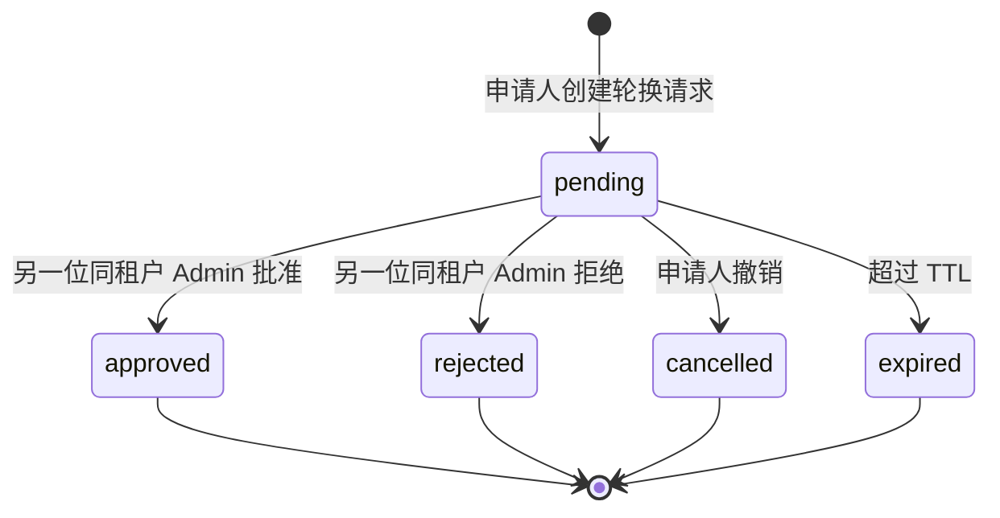
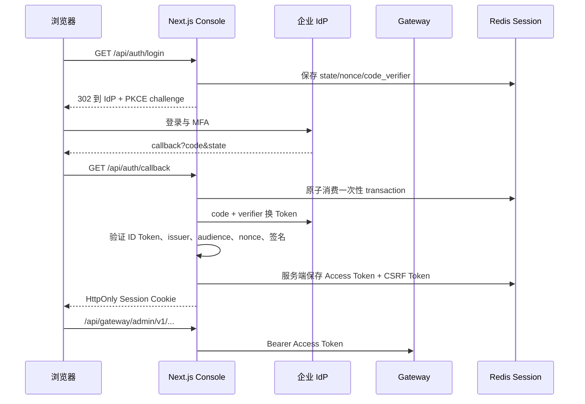
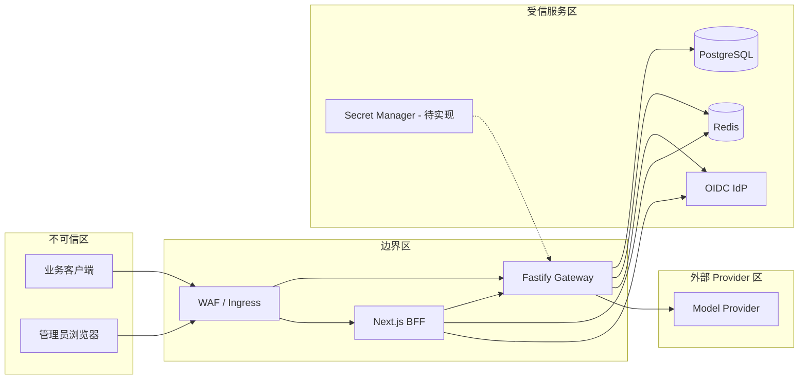

# Enterprise AI Gateway 平台总设计

- 文档版本：1.0
- 对应系统版本：0.20.0
- 更新日期：2026-07-15
- 文档定位：从平台架构、部署边界、核心请求链路一直讲到模块、数据和待实现能力
- 目标读者：技术领导、平台架构师、传统前端背景的新工程师、运维与安全团队

## 0. 怎么阅读这份文档

如果只有 10 分钟：阅读第 1、2、3、13 节，理解系统价值、架构边界和剩余风险。

如果要接手开发：继续阅读第 4–10 节，再根据第 14 节代码地图进入具体文件。

如果要评估生产上线：重点阅读第 8、11、12、13 节，并把标记为“生产化待完成”的内容纳入上线门禁。

本文使用三种状态：

| 状态 | 含义 |
|---|---|
| 已实现 | 代码、测试和构建已经存在，可在当前仓库运行 |
| Baseline exists | 已有可工作的基础版本，但还缺多实例、HA、合规或规模化能力 |
| 未实现 / Deferred | 当前代码没有交付；Deferred 表示产品上明确暂缓 |

---

## 1. 平台定位

### 1.1 一句话定义

AI Gateway 是企业应用访问大模型的统一策略执行点：业务应用不直接持有各家模型凭证，而是使用企业虚拟 Key 调用网关；网关统一完成身份、权限、配额、内容安全、预算、路由、审计和可观测性。

它不是简单的 HTTP 转发代理。普通代理只解决“请求如何到达上游”，企业 AI Gateway 还要回答：

- 谁在调用？属于哪个租户、项目和应用？
- 可以调用哪些逻辑模型？
- 当前是否超过请求、Token、并发或预算限制？
- Prompt 是否违反企业安全策略？
- 多个模型部署中应选哪一个，失败后能否安全切换？
- 一次调用最终用了多少 Token、多少钱、由谁负责？
- 管理员修改配置时，是否越权、是否经过审批、能否审计？

### 1.2 平台价值

| 对象 | 没有网关 | 使用本平台 |
|---|---|---|
| 业务前端/后端 | 每个应用分别接供应商 SDK、保管密钥 | 统一 OpenAI-compatible 接口和虚拟 Key |
| 平台团队 | 无法统一限制模型和成本 | 在控制面配置模型、配额、预算和护栏 |
| 安全团队 | Prompt、凭证和管理员操作分散 | 统一身份、Tenant Scope、Guardrail 和审计 |
| 财务/管理者 | 只能看供应商总账 | 按租户聚合 Token 和网关估算成本 |
| 运维团队 | 每个应用分别监控供应商故障 | 统一指标、路由事件、Dashboard 和告警 |

### 1.3 当前范围边界

当前主要面向文本对话生成，公开数据面接口为：

- `POST /v1/chat/completions`
- `GET /v1/models`

当前 Provider 包括 Mock 和 OpenAI-compatible。Anthropic 原生 Messages 协议明确暂缓；Embeddings、Responses 等其他模型接口尚未形成正式产品范围。

---

## 2. 架构总览

### 2.1 系统上下文



### 2.2 两个平面

平台采用企业基础设施常见的“数据面 + 控制面”分离思路。

| 平面 | 主要用户 | 核心职责 | 性能倾向 |
|---|---|---|---|
| 数据面 Data Plane | 业务应用 | 接收模型调用、实时执行认证/配额/护栏/路由、返回回答 | 高并发、低延迟、失败可观测 |
| 控制面 Control Plane | 平台管理员 | 管理 Key、模型部署、配额、预算、护栏、审批和审计 | 强权限、强审计、正确性优先 |

前端类比：数据面像面向用户的页面渲染链路，要求每次访问都快；控制面像 CMS 管理后台，修改不频繁，但每一次修改都要有权限、版本和审计。

### 2.3 逻辑分层



核心依赖方向是从上到下。Provider 字段不能反向渗透到身份、配额或控制面；这由 Canonical Schema 和 `ModelProvider` 接口隔离。

---

## 3. 部署架构

### 3.1 本地开发拓扑

| 组件 | 默认地址 | 是否必需 | 说明 |
|---|---|---|---|
| Gateway | `127.0.0.1:3000` | 是 | Fastify 数据面和控制面 API |
| Admin Console | `127.0.0.1:3100` | 管理后台需要 | Next.js 页面、OIDC Callback 和 BFF |
| PostgreSQL | `127.0.0.1:5433` | 可选 | 不配置时使用内存控制面 |
| Redis | `127.0.0.1:6380` | 可选 | 不配置时使用内存配额；生产配额必须使用 Redis |
| Prometheus | `127.0.0.1:9090` | 可选 | 指标采集与规则 |
| Alertmanager | `127.0.0.1:9093` | 可选 | 本地告警分组，不向外发送消息 |
| Grafana | `127.0.0.1:3001` | 可选 | 预置 Dashboard |

### 3.2 建议生产拓扑



这张图是目标拓扑，不代表当前所有生产能力已经完成。以下部分仍需平台团队补齐：

- Gateway 配置热更新和路由健康状态目前没有跨实例广播。
- Next→Gateway 尚未实现 mTLS/服务身份。
- 本地 Owner 使用账号文件，不适合多实例。
- Prometheus、Alertmanager、Grafana 的仓库模板是单实例开发拓扑。
- PostgreSQL/Redis 的 HA、备份、TLS、容量和恢复由企业数据平台提供。

---

## 4. 数据面详细设计

### 4.1 非流式请求完整链路



执行顺序有意固定为：认证 → Guardrail/预算 → 模型 ACL → 配额预留 → Provider 路由 → 配额结算 → 成本记录。

重要取舍：

- Guardrail 和已耗尽预算在 Provider 调用前阻断，避免产生无效模型成本。
- 配额先预留再调用，避免并发请求全部通过检查后一起超限。
- Provider Usage 可用时按实际值结算；不可用时保守使用预留值或估算值。
- 成本记录失败只写错误日志，不把已经成功生成的回答改成 500。

### 4.2 流式 SSE 链路

流式调用不能简单地把上游字节复制给客户端。系统先将 Provider 流转换成四类 Canonical Event：

1. `response_start`
2. `content_delta`
3. `usage`
4. `response_end`

然后再编码成 OpenAI-compatible SSE chunk。

关键安全与可靠性规则：

- 只有拿到合法的第一个 `response_start` 前，路由器才允许切换部署。
- 第一段内容已经发给客户端后，禁止拼接另一个 Provider 的回答。
- Node.js `write()` 返回背压信号时等待 `drain`，避免慢客户端拖垮内存。
- 客户端断开、服务端超时或响应关闭都会触发 `AbortController`，向上游传播取消。
- 流结束时发送 `[DONE]`；已发 Header 后的错误通过 SSE error chunk 表达。
- `usage` 事件用于配额结算、成本记录和 Token 指标。

### 4.3 协议边界

外部 API 使用 OpenAI-compatible 字段，内部使用 Canonical 类型：

| 外部概念 | 内部类型 | 原因 |
|---|---|---|
| `model` | `logicalModel` | 业务只认稳定逻辑名，不绑定供应商模型名 |
| `messages` | `CanonicalMessage[]` | Provider Adapter 统一转换 |
| `max_tokens` | `maxOutputTokens` | 隔离不同供应商命名 |
| SSE chunk | `CanonicalStreamEvent` | 避免路由层解析供应商专用事件 |
| Provider Usage | `CanonicalUsage` | 统一 Token、估算标记和成本口径 |

### 4.4 虚拟 Key 身份

业务调用使用 Bearer 虚拟 Key。服务不直接保存明文 Key，而是计算：

```text
keyHash = HMAC-SHA256(GATEWAY_KEY_PEPPER, rawKey)
```

认证成功后形成 `AuthContext`：

```text
keyId + tenantId + projectId + applicationId + allowedModels
```

后续模块只接触 `AuthContext`，不再接触原始 Key。`GET /v1/models` 和实际模型调用执行相同模型 ACL，避免“列表隐藏但直接调用仍能越权”。

### 4.5 配额执行

系统支持四级 Scope：tenant、project、application、key；每条策略可包含：

- Requests Per Minute
- Tokens Per Minute
- Max Concurrent

生产 Redis 实现通过一段 Lua 脚本原子完成所有匹配策略的检查和预留。所有相关 Key 使用同一 Redis Cluster Hash Tag，保证跨策略原子性，代价是这些配额状态集中在一个 Cluster Slot。

配额生命周期：

```text
estimate → reserve → provider call → settle(actual)
                              └────→ cancel(0) on failure
```

### 4.6 模型路由与可靠性

一个逻辑模型可对应多个部署。选择算法：

1. 排除本次已经尝试的部署。
2. 排除冷却、熔断开启或已有半开探测的部署。
3. 选择数值最小的优先级层。
4. 在同一优先级内按权重随机。
5. 对可重试 Provider 错误尝试下一个不同部署，最多 `maxAttempts`。

路由健康状态包括连续失败次数、429 冷却时间、熔断开启时间和半开探测占用。当前状态在单个 Gateway 进程内维护；跨实例共享属于未实现能力。

---

## 5. 控制面详细设计

### 5.1 控制面资源

| 资源 | 作用 | Tenant 规则 | 持久化 |
|---|---|---|---|
| Virtual Key | 业务身份、模型权限和启停 | 明确 tenant/project/application | PostgreSQL 或内存 |
| Rotation Request | 双人 Key 轮换审批 | 与 Key tenant 一致 | PostgreSQL 或内存 |
| Admin Notification | 轮换站内通知和已读状态 | tenant + 可选目标 Actor | PostgreSQL 或内存 |
| Model Deployment | 逻辑模型与 Provider 部署 | 当前必须为全局 `*` | `governance_resources` |
| Quota Policy | 动态 RPM/TPM/并发 | tenant-scoped | `governance_resources` |
| Pricing Rule | 模型 Token 单价 | tenant-scoped | `governance_resources` |
| Budget | 月度预算 | tenant-scoped | `governance_resources` |
| Guardrail Policy | 输入安全策略 | tenant-scoped | `governance_resources` |

### 5.2 管理 API

管理接口统一位于 `/admin/v1`：

- 身份：`GET /admin/v1/me`
- Key：创建、列表、更新、直接轮换
- 审批：创建申请、列表、批准、拒绝、撤销
- 通知：列表、标记已读
- 审计：Key 审计事件列表
- 治理资源：模型部署、配额、价格、预算、护栏的列表/创建/更新
- 用量：`GET /admin/v1/governance-usage`

更新操作使用 `If-Match` 携带资源版本。版本不一致返回 409，缺少版本返回 428，防止两位管理员基于旧页面互相覆盖。

### 5.3 双人 Key 轮换

生产建议禁止直接轮换。标准流程：



数据库通过行锁、Key version 和“每个 Key 只有一个 pending”的唯一索引，保证并发批准最多一次成功。申请人不能自批；批准时若 Key 已被其他操作改变，旧申请失败。

### 5.4 治理资源热应用

- Model Deployment 创建/更新后立即修改当前进程的 `ProviderRegistry`。
- 动态 Quota Policy 在请求时按租户读取并合并环境基线策略。
- Budget 和 Guardrail 在 Provider 调用前读取。
- Pricing Rule 在 Provider 返回 Usage 后计算并累加月度用量。

当前 PostgreSQL 是配置事实源，但运行时缓存/Registry 的跨实例失效广播尚未实现。

---

## 6. 管理员身份、登录与管理后台

### 6.1 三种管理员认证模式

| 模式 | 场景 | 身份特点 | 生产建议 |
|---|---|---|---|
| Local | 尚未配置 IdP 的首次落地 | 唯一 Owner、scrypt 密码、短期 HS256 Token | 单实例过渡使用 |
| OIDC | 企业正式使用 | IdP subject、roles、tenant scopes、远程 JWKS | 推荐 |
| Static | 本地调试或 break-glass | 单一全局 Admin Actor | 生产默认拒绝 |

### 6.2 RBAC 与 Tenant Scope

| 角色 | Key 读取 | Key 创建/更新 | Key 轮换审批 | 治理读取 | 治理修改 | 审计读取 |
|---|---:|---:|---:|---:|---:|---:|
| viewer | 是 | 否 | 否 | 是 | 否 | 是 |
| operator | 是 | 是 | 否 | 是 | 是 | 是 |
| admin | 是 | 是 | 是 | 是 | 是 | 是 |

RBAC 回答“能不能执行某类动作”，Tenant Scope 回答“可以操作哪些租户”。两者必须同时满足。OIDC Claim 缺失或无法映射时默认得到空权限，而不是全局权限。

### 6.3 OIDC 登录链路



浏览器从不读取 Gateway Access Token。Cookie 只包含签名随机 Session ID，真正 Token 保存在 Next 服务端内存或 Redis。

### 6.4 Local Owner 首次注册

首次启动且账号文件不存在时，管理后台展示组织名称、用户名和强密码表单：

1. Next BFF 校验请求 Origin。
2. Gateway 校验生产 Bootstrap Token、字段和密码强度。
3. 使用随机 Salt + scrypt 生成密码摘要。
4. 账号文件用独占 `wx` 创建，两个并发注册只有一个成功。
5. Gateway 签发 15 分钟默认短期 Token。
6. Next 创建 HttpOnly Session，注册入口自动关闭。

当前账号文件默认是 `.data/admin-local-owner.json`。它解决“没有 OIDC 无法进入”的问题，但不是多用户、多实例账号系统。

### 6.5 Next.js BFF 安全边界

BFF 只允许代理 `admin/v1/`，拒绝 `..`、反斜杠、空段和任意其他 Gateway 路径。写请求必须同时满足：

- 有效 HttpOnly Session
- Origin 与公开管理后台地址一致
- `X-CSRF-Token` 与服务端 Session 中的值恒定时间比较一致

BFF 只向 Gateway 转发必要 Header：Authorization、If-Match 和 Content-Type；不做开放式反向代理，也不跟随上游重定向。

---

## 7. 数据与存储设计

### 7.1 PostgreSQL Schema

当前迁移版本为 5，启动迁移使用 PostgreSQL Advisory Lock，避免多个实例同时执行 DDL。

| 表 | 主要内容 |
|---|---|
| `gateway_schema_migrations` | 已应用 Schema 版本 |
| `virtual_keys` | Key 摘要、租户层级、模型 ACL、启停和版本 |
| `audit_events` | Key 生命周期、管理员身份、前后状态、Trace |
| `virtual_key_rotation_requests` | 双人轮换状态机与决策人 |
| `admin_notifications` | 审批站内通知 |
| `admin_notification_reads` | 每个管理员独立已读回执 |
| `governance_resources` | 五类治理资源的版本化 JSON Spec |
| `governance_audit_events` | 治理资源修改前后状态 |
| `governance_usage` | tenant + month + currency 聚合用量与金额 |

### 7.2 Redis 数据

Redis 承担两类不同职责：

| 使用者 | 数据 | 原子性 |
|---|---|---|
| Gateway Quota | 分钟窗口 Hash、并发 Reservation Sorted Set | Lua reserve/settle 原子执行 |
| Next Admin Session | Session、OIDC Transaction | Session TTL；Transaction 使用 `GETDEL` 一次性消费 |

生产可以使用同一 Redis 服务的不同前缀，但更建议按容量、权限和故障域拆分实例或数据库。

### 7.3 内存模式

不配置 PostgreSQL 时：

- Virtual Key、治理资源、审批和站内通知使用内存 Repository。
- Owner 账号文件仍持久化。
- Gateway 重启后控制面回到环境变量种子。

不配置 Redis 时：

- 开发环境配额和 Next Session 可使用单进程内存。
- 生产 Next Session 明确要求 Redis，不会静默退回内存。

---

## 8. 安全架构

### 8.1 信任边界



### 8.2 已实现控制

- 虚拟 Key 和数据库只存 HMAC 摘要，不记录明文。
- Local 密码使用 scrypt、随机盐、文件权限 0600。
- 管理 JWT 固定 issuer、audience、typ、算法和有效期。
- OIDC JWKS 地址来自配置，不接受 Token 自带任意 URL。
- RBAC + Tenant Scope 默认拒绝。
- BFF 路径白名单、HttpOnly Cookie、CSRF、Origin 校验。
- 管理写操作使用 `If-Match` 防旧页面覆盖。
- 双人轮换防自批、过期和并发重复批准。
- Metrics 使用独立 Bearer Token。
- 日志不记录 Authorization、Prompt 或请求正文。
- 统一请求大小和字段 Schema 校验，错误不回传内部堆栈。

### 8.3 生产安全待完成

- Provider Credential 接入企业 Secret Manager，并支持版本和轮换。
- Next→Gateway 使用 mTLS 或工作负载身份，而不只是内部网络可达。
- Local 多用户账号、MFA、密码找回、即时 Token 吊销。
- OIDC IdP logout、Refresh Token 或即时撤权/introspection。
- Pepper 在线轮换和历史摘要迁移。
- 专业 DLP、输出护栏、多模态检查和安全例外审批。
- 审计归档、不可篡改存储、SIEM 投递和保留期限。

---

## 9. 治理能力细分

### 9.1 模型部署

`ModelDeploymentSpec` 包含逻辑模型、Provider 类型、供应商模型、Base URL、凭证环境变量引用、优先级和权重。全局模型资源使用 `tenantId="*"`。

已实现：创建、列表、启停、API 更新完整 Spec、启动加载和当前进程热发布。

未实现：草稿、审批、定时发布、灰度、回滚、控制台完整字段编辑、跨实例广播。

### 9.2 动态配额

已实现：租户/项目/应用/Key 四级策略、RPM/TPM/并发、Redis 原子预留、管理 API 和控制台页面。

未实现：策略模拟器、草稿审批、滑动窗口/令牌桶、读缓存和失效广播、Redis 故障期间的企业级降级决策。

### 9.3 成本与预算

当前根据逻辑模型 Pricing Rule 和 Provider Usage 计算：

```text
amount = inputTokens × inputPerMillion / 1,000,000
       + outputTokens × outputPerMillion / 1,000,000
```

已实现：CNY/USD 定价、本月租户聚合、月预算硬阻断、控制台展示。

未实现：原子预算预留、日预算、项目/应用预算、预警外部投递、汇率、退款、跨月结转和供应商账单对账。当前金额是网关估算，不应直接作为财务结算凭证。

### 9.4 Guardrail

已实现输入文本规则：

- PII：邮箱、13–19 位数字模式
- Prompt Injection：中英文忽略系统指令模式
- Content Safety：少量爆炸物关键词基线
- `audit` 或 `block` 模式

当前 `audit` 只放行，没有独立安全事件指标。正则规则不能识别图片、附件、编码逃逸和复杂语义攻击。

未实现：输出检查、脱敏改写、专业 DLP/内容审核服务、多模态、例外审批、人工复核、评估集和效果指标。

---

## 10. 可观测性与错误设计

### 10.1 三类证据

| 类型 | 回答的问题 | 当前实现 |
|---|---|---|
| Metrics | 系统整体是否健康 | HTTP、Provider、路由事件、活跃请求、Token 等低基数指标 |
| Trace Context | 一次请求经过哪些系统 | 接收/生成 W3C `traceparent`，响应和 Provider 继续传递 |
| Audit | 谁修改了什么 | Key 与治理资源的 Actor、前后状态、requestId、traceId |

日志用于工程排障，审计用于责任追溯，两者不能混为一谈。

### 10.2 Dashboard 与告警

仓库提供：

- Prometheus 固定镜像和抓取配置
- 9 条 SLI Recording Rule
- 7 条告警
- 11 面板 Grafana Dashboard
- Alertmanager 分组、重复间隔和抑制规则
- promtool 合成告警测试和新人值班手册

生产仍需配置真实 Receiver、责任人、SLO 审批、阈值校准、HA 和备份。

### 10.3 统一错误

数据面错误返回：

```json
{
  "error": {
    "message": "...",
    "type": "error_code",
    "code": "error_code",
    "retryable": false,
    "request_id": "req-..."
  }
}
```

主要语义：

| HTTP | 代表含义 | 示例 |
|---:|---|---|
| 400 | 输入或内容策略不允许 | `invalid_request_error`、`content_policy_violation` |
| 401 | 身份无效 | Virtual Key/Admin Token 错误 |
| 403 | 身份有效但无权限 | 模型 ACL、Tenant Scope、RBAC、CSRF |
| 404 | 资源或逻辑模型不存在 | `model_not_found` |
| 409 | 资源版本/审批状态冲突 | `version_conflict`、`approval_conflict` |
| 428 | 缺少 If-Match | `precondition_required` |
| 429 | 配额、预算或 Provider 限流 | `quota_*`、`budget_exceeded` |
| 502/503/504 | Provider 或依赖不可用 | `provider_unavailable`、readiness 失败 |

`retryable` 由网关根据错误类别决定，客户端不应只看 HTTP 状态盲目重试。

---

## 11. 可用性、扩展性与运维

### 11.1 健康检查

- `/health/live`：进程事件循环仍能响应。
- `/health/ready`：配置 PostgreSQL 控制面时检查数据库；失败返回 503。

当前 readiness 没有覆盖 Redis、Provider、Next Session Store 等所有依赖。是否将某个外部依赖纳入 readiness，必须考虑级联摘流风险。

### 11.2 超时与取消

- Provider 请求受统一超时控制。
- 客户端断开向 Provider 传播取消。
- BFF→Gateway 管理请求有 10 秒超时。
- OIDC Discovery、Token Exchange、JWKS 各自有边界超时。
- 配额 Reservation 有 TTL，异常情况下最终自动释放。

### 11.3 水平扩展现状

| 状态 | 单实例 | 多实例 |
|---|---|---|
| 业务虚拟 Key（PostgreSQL） | 支持 | 支持 |
| 配额（Redis） | 支持 | 支持，所有策略集中同一 Slot |
| 管理 Session（Redis） | 支持 | 支持 |
| 审批与审计（PostgreSQL） | 支持 | 支持 |
| 模型热发布 | 支持当前实例 | 缺少广播 |
| 路由熔断/冷却 | 支持当前实例 | 状态不共享 |
| Local Owner 账号文件 | 支持 | 不支持 |
| 监控模板 | 支持开发 | HA/长期存储未交付 |

### 11.4 配置与发布

Gateway 从根目录 `.env` 和系统环境变量读取配置，系统环境变量优先。生产弱 Secret、缺失数据库/Redis 要求或危险 Static Admin 模式会 fail fast。

数据库迁移推荐由独立发布 Job 执行 `npm run db:migrate`，应用进程设置 `DATABASE_AUTO_MIGRATE=false`，避免应用启动权限包含 DDL。

---

## 12. 测试与质量策略

### 12.1 当前验证入口

```bash
npm run verify
```

执行顺序：

```text
TypeScript strict typecheck
→ Vitest 单元与 HTTP 集成测试
→ Gateway production build
→ Next.js production build
```

0.20.0 基线：22 个测试文件、94 项测试通过；PostgreSQL 和 Redis 的 3 项外部依赖集成测试默认跳过，需要显式提供本地测试地址。

### 12.2 测试分层

| 层级 | 示例 | 目的 |
|---|---|---|
| 纯单元 | Token 估算、路由选择、Origin 推导 | 快速验证算法边界 |
| Fastify Inject | 认证、租户隔离、审批、治理 | 不占端口验证真实路由与 Hook |
| Repository Integration | PostgreSQL、Redis Lua | 验证事务、锁、索引和原子性 |
| Process Smoke | HTTP/SSE、OIDC、Admin Session | 验证真实端口、Cookie、重定向和流 |
| Asset Validation | Prometheus、Alertmanager、Grafana | 防止配置与 Dashboard 失效 |
| Production Build | Gateway + Next | 捕获类型、Bundle 和 Route Handler 问题 |

### 12.3 每轮完成定义

新增能力至少需要：成功路径、关键失败路径、生产构建、更新文档；涉及数据库、Redis、浏览器或多实例时还需要真实依赖验收。仅页面能点击或单元函数能调用，都不等于平台能力完成。

---

## 13. 未实现能力与路线图

### 13.1 P0：进入企业多人和多实例运营前必须补齐

| 建议迭代 | 能力 | 当前缺口 | 完成标志 |
|---|---|---|---|
| Iteration 21 | 主组织成员与账号管理 | 只有唯一 Local Owner | PostgreSQL 账号仓库、邀请、角色、停用、重置；可由不同管理员完成双人审批 |
| Iteration 22 | 多实例控制面一致性 | 热发布和路由健康为进程内状态 | 配置版本缓存、失效广播、共享健康或明确的一致性策略 |
| Iteration 23 | Secret 与服务身份 | 凭证依赖环境变量，BFF→Gateway 为普通 HTTP | Secret Manager、轮换、访问审计、mTLS/工作负载身份、Pepper 轮换 |

### 13.2 P1：规模化管理与治理

| 建议迭代 | 能力 | 主要内容 |
|---|---|---|
| Iteration 24 | 管理后台规模化体验 | Cursor 分页、服务端搜索、完整部署编辑、批量操作、导出、组织成员页 |
| Iteration 25 | 高级 Guardrail | 输出检查、DLP/内容审核、脱敏、多模态、例外审批、安全事件指标 |
| Iteration 26 | 成本与预算准确性 | 原子预算预留、多层预算、预警、汇率、退款、账单对账 |

其他 P1：

- OIDC Session 续期、IdP logout、即时撤权/introspection。
- 模型发布草稿、审批、定时发布、灰度和回滚。
- 配额策略模拟、草稿审批、缓存和滑动窗口/令牌桶。
- 全局自适应路由、区域/成本/延迟策略。
- 审计保留归档、SIEM 和不可篡改存储。

### 13.3 P2：平台深度能力

| 建议迭代 | 能力 | 主要内容 |
|---|---|---|
| Iteration 27 | Trace 与生产可观测性 | OpenTelemetry SDK/Collector、Trace Backend、阈值校准、监控 HA/备份 |
| 待排期 | API 扩展 | Tool Calling 完整回归、Embeddings/Responses 等接口评估 |
| 待排期 | 更高级路由 | 跨实例健康、全局负载、成本/质量/延迟自适应 |

### 13.4 明确暂缓

| 能力 | 状态 | 重新启动条件 |
|---|---|---|
| Anthropic 原生 Messages 协议 | Deferred | 出现 OpenAI-compatible 无法满足的明确客户需求 |
| Iteration 14 外部邮件/IM/Webhook Outbox | Deferred | 企业确认通知渠道、责任团队、重试、死信和保留要求 |

站内审批通知已经实现；暂缓的是飞书、钉钉、邮件或 Webhook 的可靠投递。

### 13.5 外部团队依赖

| 团队 | 需要决策或提供 |
|---|---|
| 身份平台 | OIDC Issuer/Client、Group/Claim、MFA、撤权和 logout 策略 |
| Secret 平台 | Vault/云 Secret Manager、服务身份和轮换 |
| 数据库平台 | PostgreSQL HA、备份恢复、迁移发布流程 |
| Redis 平台 | Redis HA、TLS、容量和故障降级策略 |
| 网络平台 | 域名、证书、Ingress/WAF、服务间网络策略 |
| 可观测性平台 | OTel Backend、告警 Receiver、值班责任人、保留周期 |
| 安全平台 | DLP/内容审核服务、例外审批和评估标准 |

更细的优先级矩阵持续维护在 [待实现能力清单](./BACKLOG.md)。

---

## 14. 代码地图

### 14.1 Gateway

| 目录/文件 | 职责 |
|---|---|
| `src/index.ts` | 加载配置、启动 Fastify、优雅退出 |
| `src/server/app.ts` | 依赖装配、全局 Hook、错误、日志和路由注册 |
| `src/server/routes/chat-completions.ts` | 非流式/流式数据面编排 |
| `src/core/` | Canonical Schema、错误和请求上下文 |
| `src/auth/` | 业务虚拟 Key 与模型 ACL |
| `src/quota/` | 策略匹配、预留/结算、内存和 Redis Store |
| `src/providers/` | Provider 契约、Registry、Mock、OpenAI-compatible 和 SSE Parser |
| `src/routing/` | 优先级、权重、失败切换、冷却和熔断 |
| `src/admin-auth/` | Local/Static/OIDC 管理员认证与 RBAC |
| `src/control-plane/` | Key Repository、迁移、审批、通知和审计 |
| `src/governance/` | 模型、配额、定价、预算、Guardrail 和用量 |
| `src/observability/` | Prometheus 指标和 Trace Context |
| `src/config.ts` | 环境变量解析和生产安全门 |

### 14.2 Next.js Admin Console

| 目录/文件 | 职责 |
|---|---|
| `apps/admin-console/components/admin-console.tsx` | 登录、总览、Key、审批、通知和审计界面 |
| `components/governance-panel.tsx` | 模型、配额、预算和护栏页面 |
| `app/api/auth/` | OIDC、Local 登录、Session 和退出 Route Handler |
| `app/api/gateway/[...path]/route.ts` | 受限同源 BFF |
| `lib/session.ts` | HttpOnly Session、Redis/内存 Store、OIDC Transaction |
| `lib/oidc.ts` | Discovery、PKCE、Code Exchange、ID Token 验证 |
| `lib/security.ts` / `origin.ts` | Origin、CSRF 和公开地址推导 |

### 14.3 数据与运营资产

| 位置 | 职责 |
|---|---|
| `src/control-plane/migrations.ts` | PostgreSQL Schema v1–v5 |
| `compose.yaml` | 本地 PostgreSQL、Redis 和可观测性组件 |
| `observability/` | Prometheus、Alertmanager、Grafana、规则和 Dashboard |
| `scripts/` | Smoke、迁移和资产验证 |
| `test/` | 单元、HTTP、集成和安全回归测试 |
| `docs/adr/` | 关键架构决策及其代价 |
| `docs/iterations/` | 每轮设计、验证和已知限制 |

---

## 15. 新工程师接手顺序

1. 运行 `npm run verify`，先确认本机基线没有问题。
2. 阅读 `src/server/app.ts`，理解依赖如何组装。
3. 阅读 `chat-completions.ts`，画出一次模型请求的顺序。
4. 阅读 `AuthService`、`QuotaService`、`GovernanceService` 和 `ModelRouter`，理解策略执行点。
5. 阅读 PostgreSQL migrations，理解控制面事实数据。
6. 阅读 Next BFF 和 Session，确认浏览器为什么拿不到 Access Token。
7. 根据要开发的能力阅读对应 ADR 和 Iteration 文档。
8. 修改前先在 [待实现能力清单](./BACKLOG.md) 明确本轮目标、非目标和完成定义。

---

## 16. 架构 Review 检查表

领导和架构师在每次上线前至少确认：

- 当前部署是演示、单实例生产还是多实例生产？
- PostgreSQL、Redis、Secret、OIDC 和网络边界分别由谁负责？
- 是否仍有 Local Owner、Static Admin Token 或开发默认 Secret？
- 多实例配置更新是否有广播或可接受的一致性窗口？
- 配额、预算、Guardrail 的失败策略是否经过业务批准？
- Provider 切换会不会导致数据跨区域或跨供应商？
- 审计、日志和指标的保留期限是否满足公司政策？
- 告警是否真的能通知到值班人员，而不只是 Dashboard 上变红？
- 灾难恢复是否实际演练过，而不只是“数据库有备份”？
- 本轮新增能力是否同时更新测试、Runbook、ADR/Iteration 和本总设计？

这份文档描述 0.20.0 的真实基线。代码变化如果改变了信任边界、状态归属、接口语义或多实例行为，必须同步更新本文，而不能只修改实现。
